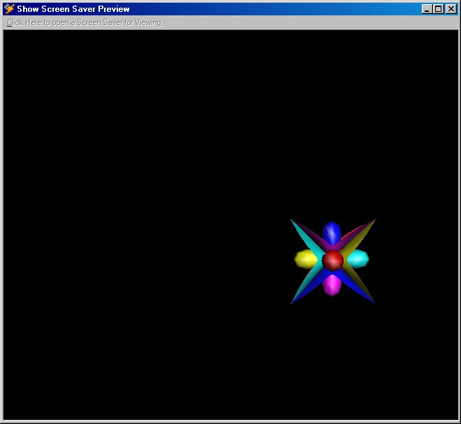



## Show Screen Saver In VB

### Description

Just a small program to show how to show a screen saver in a picture box from within VB. Also has some other usefull functions.

This is just a small program I was playing with. It is not complete and I don't know if it would be usefull to anyone, but I thought I would upload it anyway.
 
### More Info
 

             |
---                |---
**Submitted On**   |2000-10-23 08:33:18
**By**             |[John Zimmerman](https://github.com/Planet-Source-Code/PSCIndex/blob/master/ByAuthor/john-zimmerman.md)
**Level**          |Intermediate
**User Rating**    |5.0 (10 globes from 2 users)
**Compatibility**  |VB 6\.0
**Category**       |[Miscellaneous](https://github.com/Planet-Source-Code/PSCIndex/blob/master/ByCategory/miscellaneous__1-1.md)
**World**          |[Visual Basic](https://github.com/Planet-Source-Code/PSCIndex/blob/master/ByWorld/visual-basic.md)
**Archive File**   |[CODE\_UPLOAD1089010232000\.zip](https://github.com/Planet-Source-Code/john-zimmerman-show-screen-saver-in-vb__1-12241/archive/master.zip)

